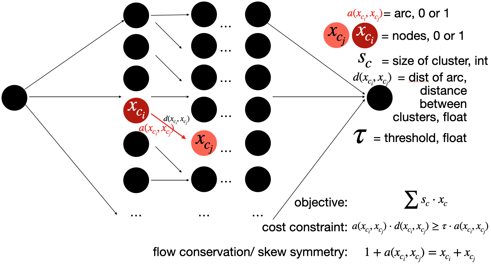
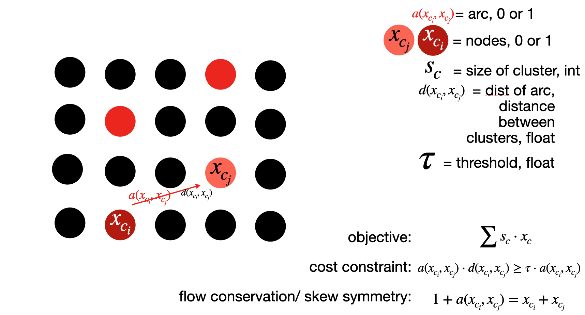

### **INSTALLS::**

Once python 3 is installed

pip install pandas

pip install pulp

pip install matplotlib

pip install ast?

### **RUN::**

from ones preferred folder, with git installed  

 ``git clone https://github.com/mehfoudcm/seat-optimizer.git``

Then, from inside this folder (seat-optimizer) run the following script but for the appropriate seat map file
 
 ``python seat_optimizer.py "hurricanes_xy_sample.csv" 36 [2] [1] "section" 500 "not_normal" "aisle_seats"``

* python - to run it in python
* seat_optimizer.py - seat_optimizer (program)
* "hurricanes_xy_coordinates.csv" - original seat map with 'section_label', 'row_label', 'seat_num', 'seat_center_x', 'seat_center_y', 'venuesid', 'seatsid' 
	
	- seatsid = concatenation of venue, section, row, seat number
					
* 36 - threshold (36 units based on KORE map is about 6 feet); this measure is experimental and should be adjusted based on your own concerns and guidelines given by authorities
* [2] - array of seat cluster sizes, without more compute, one size should be chosen
* [1] - array of seat cluster percentages, 100% if one size chosen
* "section" - algorithm breakdown, optimized based on section is the preferred way
* 500 - time limit for optimization, less time will only produce a feasible seat selection if optimization is too difficult (gap set to .01)
* "not_normal" - seat ordering, not_normal is typical, but some seats are ordered correctly in each row with no gaps ("normal" does not run through the reordering process, and is fine for some arenas/stadiums)
* "aisle_seats" - whether or not to use aisle seats... if you do not want to use aisle seats, the argument here would be "no_aisle_seats"

### **Run Process::**
  
- the algorithm first creates an appropriate seat map by breaking up rows where there are gaps 
	- (this new map is saved under Row Adjusted Arena)
- then the algorithm creates clusters within rows (requiring only people who adjacent to sit next to each other, instead of in front of or behind)
	- if there are 3 seats in a row, 1, 2, and 3...and clusters are 2 people, then there are two clusters created from that row either 1-2 or 2-3
	- (these clusters are saved per section in Seating Segments)
- the program then creates distances to and from each seat cluster
	- (these distances are saved in Distances)
- then the program optimizes each section
	- (an optimization program output file is saved in LP Files, could be output to optimization server if necessary for larger sections (or in MPS format))
- then these files are aggregated as indicated seats
	- (the progress file and final files are saved in Final Seat Map)
- then a map is printed (for Windows, dpi = 300 is set, but larger can be used for mac, from experience)
	- (this map is found in Images)

### **To Do::**
		
		
	add list of already designated seats
	
	add weights for already established seats and maximize based off of weights 
	(or amount paid, ratio of distance moved to amount paid)
	

### **Motivation:**

We want to represent the seats in a stadium as a network, where the arcs represent the distance between seats or groups of seats. Based on network flow, we can understand a min cost problem, seen [here](https://en.wikipedia.org/wiki/Minimum-cost_flow_problem) and in many other places. 

Here, we want to take a network and do the opposite; maximize the nodes or arcs occupied. In other words, maximize the number of seats in the arena or stadium. There are other ways to solve this problem, but this is the path I've chosen to establish a mixed-integer linear program (Binary or zero-one; [MILP](https://en.wikipedia.org/wiki/Integer_programming)).

As follows, we can see a simple example, and how optimization can give us a larger value.

In the next example, you can see that you can increase the number of seats (or clusters) based on which seats (or clusters) are picked.

In order to create this network and keep the linear relationship of program, we must first establish clusters. In this way, we establish the nodes of the network as clusters instead of seats.

The network is then solved after we create it from the clusters (depending on cluster size). We can have different cluster sizes and different ratios of cluster sizes and that adds additional constraints to the problem.

The solution typically sees 25-35% capacity depending on the arena, cluster size, and ratio.

if any questions feel free to reach out to mehfoudcm@vcu.edu
